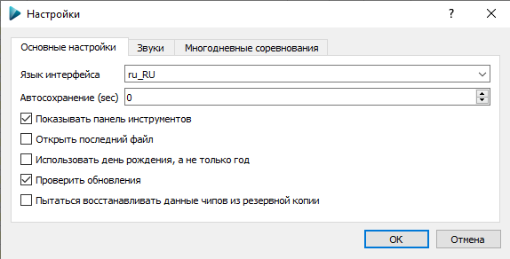
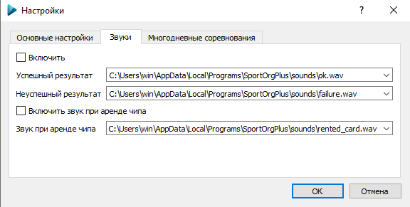

# Диалог настроек

Данный диалог позволяет редактировать общие настройки программы. 
При [многодневных соревнованиях](../../user-guide/multiday.md) настройки общие для всех дней.

## Основные настройки

### Язык интерфейса

В данный момент предусмотрены два языка интерфейса: русский и английский.
Изменения вступят в силу после перезапуска приложения.

### Автосохранение

Вы можете указать время авотосохранения файла соревнований (в секундах).
Рекомендуется использовать автосохранение с настройкой 30-60 секунд.
При случайном закрытии приложения или отключении питания компьютера большинство изменений будут сохранены. 

Нежелательно использовать автосохранение чаще 1 раза в 10 секунд.
При этом возможно снижение производительности приложения для соревнований со 100 участниками и более.
При задании 0 автосохранение будет отключено.

### Показать панель инструментов

Отображение или скрытие Панели инструментов.
Изменения вступят в силу после перезапуска приложения.

### Открыть последний файл

При активации этой опции после повторного запуска приложения автоматически будет открыт последний использовавшийся файл.

### Использовать день рождения, а не только год

При применении данной настройки при редактировании спортсмена можно указать не только год рождения, но и дату. 
Независимо от отображения, в файле соревнований всегда сохраняется именно дата рождения, а не только год.

Отключенная опция / Включенная опция:

### Проверять обновления

Программа при старте будет проверять наличие обновлений.
Если найдётся версия новее установленной, программа предложит скачать обновление.

### Пытаться восстанавливать данные чипов из резервной копии

Если программа будет случайно закрыта без сохранения, или пропадёт питание на компьютере,
при следующем запуске она проверит наличие считанных данных с чипов в резервной копии на диске.
Если найдутся несохранённые данные, она предложит восстановить их.

## Настройка звуков

Вы можете задать звуки, которые будут воспроизводиться при считывании чипов.
Если участник успешно прошел дистанцию, воспроизводится звуковой файл "Успешный результат".
Если у участника имеются какие-то проблемы с отметкой (пропущенный КП, недостаточно КП на дистанции по выбору),
будет воспроизведет звуковой файл "Неуспешный результат".
Поддерживаемый формат звуковых файлов - WAV. 

Для активации выберете звуковые файлы для воспроизведения и отметьте галочку "Включить".

Также можно выбрать файл и включить его воспроизведение при считывании арендных чипов.

## Многодневные соревнования

Принцип работы SportOrg такой, что пользователь работает всегда только с одним определенным днем/стартом. Редактирование участников, прием финиша происходят только в текущем дне. 
Все данные участников, финиш, сплиты, большинство настроек хранятся внутри соревновательного дня. 

Для переключения между соревновательными днями используется выпадающий список, каждая строчка которого соответствует отдельному дню, показывается время старта для этого дня, взятое из его настроек.
Для перехода на другой соревновательный день просто выберете из списка нужное значение.

### Основные операции с днями

* `Новый` Создание нового соревновательного дня. День помещается в конец списка.
* `Копировать` Копирование текущего соревновательного дня в новый. Новый день помещается в конец списка.
* `Сдвинуть вверх` Текущий соревновательный день перемещается выше по списку.
* `Сдвинуть вниз` Текущий соревновательный день перемещается ниже по списку.
* `Удалить` Текущий соревновательный день полностью удаляется. Будьте внимательны, удаление производится безвозвратно! Рекомендуем сделать резервную копию базы перед удалением.

