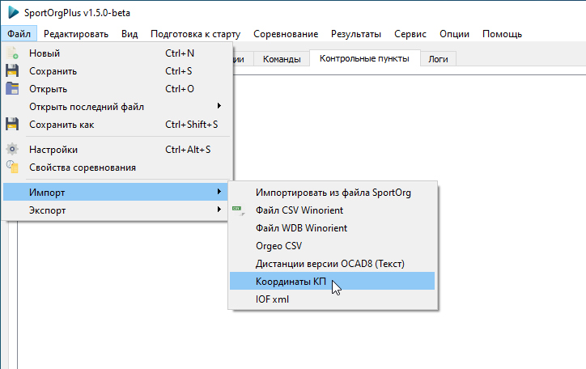
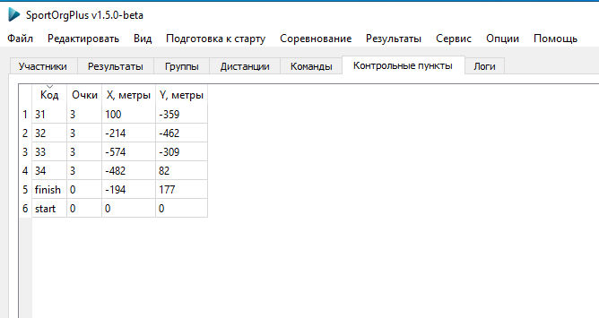
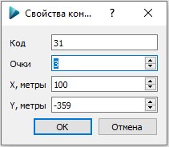

# Импорт координат контрольных пунктов

---

Для отображения длины по прямым в распечатках для дистанций рогейна и выбора
необходимо выполнить процедуру импорта координат контрольных пунктов.

Доступные форматы файлов: путевые точки в GPX, IOF XML v3 course data, CSV (Код КП, X в метрах, Y в метрах; разделитель — запятая).
Старт должен иметь код "start", "S1" или "S", финиш — "finish", "F1" или "F".
Регистр не имеет значения.

Если координат финиша не заданы, то используются координаты старта.
Если координаты старта не заданы, то используются нулевые координаты (0, 0).

После импорта на вкладке "Контрольные пункты" отобразится список КП со стоимостью (для рогейна) и координатами,
а также старт и финиш.

По двойному щелчку на строке КП отобразится диалог редактирования,
в котором можно изменить код, координаты и стоимость КП.

