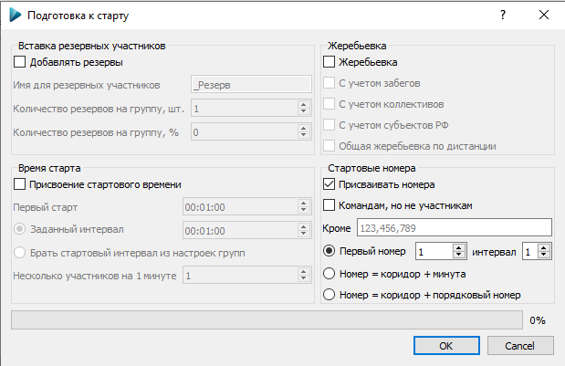

# Присвоение стартовых номеров

Применяется при необходимости присвоить стартовые номера участникам.

Для присвоения стартовых номеров отметьте пункт «Присваивать номера» в окне «Подготовка к старту».

Опции:

* `Кроме` – в поле ввода можно указать номера через запятую, которые будут пропущены при присвоении;
* `Первый номер` – первый стартовый номер для присвоения;
* `интервал` – интервал присвоения стартовых номеров;
* `Номер = коридор + минута` – данная опция используется для задания номеров, в которых 2 последних цифры совпадают со стартовой минутой, а первая начальная цифра (цифры) служат для идентификации коридора. Номера присваиваются по стартовым коридорам, при переходе к новому коридору цифра сотен увеличивается на 1;
* `Номер = коридор + порядковый номер` – данная опция используется для задания номеров, в которых 2 последних цифры совпадают с порядком старта участника внутри коридора, а первая начальная цифра (цифры) служат для идентификации коридора. Номера присваиваются по стартовым коридорам, при переходе к новому коридору цифра сотен увеличивается на 1.

Если выбрать пункт «Командам, но не участникам», то номера будут присвоены командам, с учётом выбранных опций

<!---->

<!---->

<!---->

Для систем электронной отметки SFR и Sportiduino можно назначить участникам номера чипов, равные стартовым номерам.
Для этого нужно выбрать пункт «Заменить номера чипов нагрудными номерами» в меню «Подготовка к старту»

