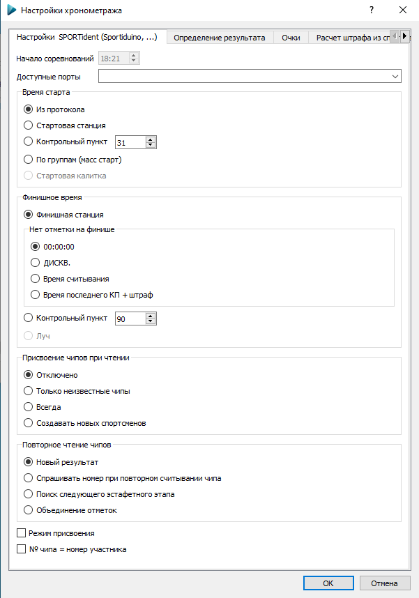

# Работа с электронной отметкой

---

Для активации чтения чипов необходимо подключить мастер-станцию (SPORTident, Sportiduino или SFR)
к компьютеру и выбрать `Сервис -> Запустить/остановить чтение чипов <...>`.

*Для работы станция SPORTident должна быть в режиме чтения чипов, рекомендуется отключить режим совместимости (Legacy protocol).*

Если в вашей системе подключено несколько COM-устройств, существует возможность выбора необходимого COM-порта. 

При чтении чипов данные будут появляться на вкладке `Результаты`.
Если чип не зарегистрирован в базе, в результатах будет строка без ФИО участника.
Можно отредактировать ее, присвоив номер участника, после этого отметка будет перепроверена.

Существует возможность присвоения номеров при считывании чипов.
В этом случае будет показано диалоговое окно для ввода номера участника.
  1. `Только неизвестные чипы` — ввод номера только для тех чипов, которые никому не присвоены.
  1. `Всегда` — для всех участников будет запрашиваться ввод номера.

Также можно изменить номер участника, если ему присвоен неправильный чип.
Все результаты при этом будут пересчитаны автоматически.

[Проверка отметки](course.md)

## Вкладка "Настройки SPORTident (Sportiduino, ...)"

`Опции -> Настройки хронометража`

Задаются источники для стартового и финишного времени.
Это могут быть специальные станции старт/финиша, станции КП с заданным номером, значение старта из базы данных, время,
полученное от стартовой калитки либо финишного луча.

Если время старта берется из стартовой станции, но спортсмен на ней не отметился, то в качестве старта будет использоваться время из протокола.
Это удобно, когда большинство спортсменов или групп стартует по протоколу, а открытые группы или опоздавшие участники отмечаются в стартовой станции.

*Проверьте, что в настройках соревнования правильно задано время начала соревнований – это нужно для работы с чипами SI5, записывающими время в 12-часовом формате.*

